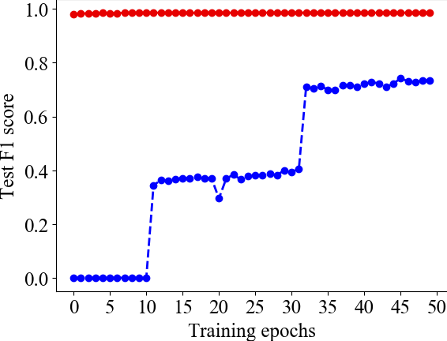
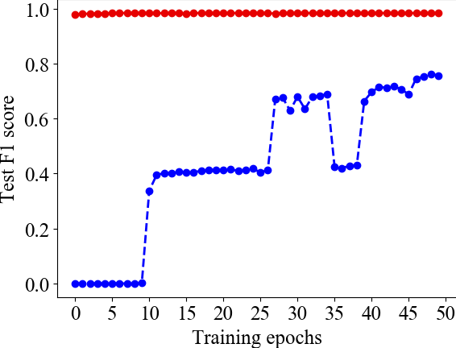
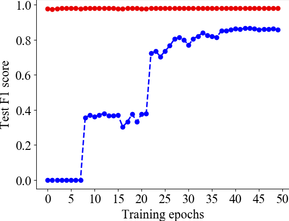
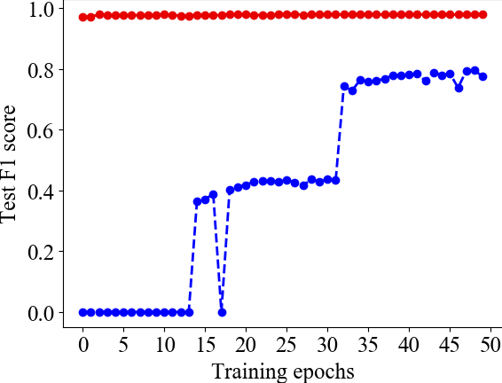

## Introduction

XDA is a tool to disassemble instructions and recovers function boundaries of stripped binaries. It is based on transfer learning using Transformer encoder with masked language modeling objective [1, 2, 3]. It outperforms state-of-the-art tools (e.g., IDA Pro, Ghidra, and bidirectional RNN [4]).

## Installation
We recommend using `conda` to setup the environment and install the required packages.

First, create the conda environment,

`conda create -n xda python=3.7 numpy scipy scikit-learn matplotlib ipython`

and activate the conda environment:

`conda activate xda`

Then, install the latest Pytorch (assume you have GPU):

`conda install pytorch torchvision cudatoolkit=10.2 -c pytorch`

Finally, enter the xda root directory: e.g., `path/to/xda`, and install XDA:

`pip install --editable .`

## Preparation

### Pretrained models:

Create the `checkpoints` and `checkpoints/pretrain_all` subdirectory in `path/to/xda`

`mkdir checkpoints`, `mkdir checkpoints/pretrain_all`

Download our [pretrained weight parameters](https://drive.google.com/file/d/18LMUt6xJGTrSJ4HoaXBUYt2le3YNGcOu/view?usp=sharing) and put in `checkpoints/pretrain_all`

### Sample data with function boundaries

We provide the sample training/testing files of pretraining and finetuning in `data-src/`

- `data-src/pretrain_all` contains the sample raw bytes from stripped binaries for pretraining
- `data-src/funcbound` contains the sample raw bytes with function boundaries

We have already provided the [pretrained models](https://drive.google.com/file/d/18LMUt6xJGTrSJ4HoaXBUYt2le3YNGcOu/view?usp=sharing) on a huge number of binaries. However, if you want to pretrain on your own collected data, you can prepare the sample files similar to the format in `data-src/pretrain_all` (concatenate all bytes from all binaries, and delimit by a newline `\n` to make sure each line does not exceed the max length that model accepts). 
Similarly, if you want to prepare the finetuning data yourself, make sure you follow the format shown in `data-src/funcbound`.

We have to binarize the data to make it ready to be trained. To binarize the training data for pretraining, run:

`./scripts/pretrain/preprocess-pretrain-all.sh`

The binarized training data ready for pretraining will be stored at `data-bin/pretrain_all`

To binarize the training data for finetuning, run:

`./scripts/finetune/preprocess.sh`

The binarized training data ready for finetuning (for function boundary) will be stored at `data-bin/funcbound`

## Training

If you are using your own parsed binaries for pretraining, and you have already binarized them in `data-bin/pretrain_all`, run:

`./scripts/pretrain/pretrain-all.sh`

To finetune the model, run:

`./scripts/finetune/finetune.sh`

The scripts loads the pretrained weight parameters from `checkpoints/pretrain_all/` and finetunes the model.

## Update since rebuttal (2020/7/28)
- bi-RNN implementation is released under ./bi-RNN/
    - To run, download our sample processed SPEC 2017 O1 dataset [training](https://drive.google.com/file/d/1me1b5sbZM8nncVWevwf7v2jEEYNF_jm_/view?usp=sharing), [testing](https://drive.google.com/file/d/1FD_9pXMiDJ61mmmeaQse4xobM8RAzPZN/view?usp=sharing) and put in `birnn/`
- Testing finetuned model on obfuscated binaries, provided by Obfuscator-LLVM
    - Control Flow Flattening
    - Bogus Control Flow
    - Instruction substitution
- Testing finetuned model on larger, more complex software Program
    - OpenSSL-1.0.1u and OpenSSL-1.0.1f
    - ImageMagic-7.0.10-11
    - LibTomCrypt-1.18.2
    - GMP-6.2.0

#### Results on running bi-RNN for more epochs
Update Figure 6 in original paper, where we run bi-RNN for 20 more epochs.

<table>
  <tr>
    <td align="center" colspan="2"></td>
  </tr>
  <tr>
    <td>O1</td>
     <td>O2</td>
  </tr>
  <tr>
    <td></td>
    <td></td>
  </tr>
  <tr>
    <td>Od</td>
     <td>Ox</td>
  </tr>
  <tr>
    <td></td>
    <td></td>
  </tr>
</table>

#### Results on obfuscated binaries and more complex software projects
We compiled all software projects using obfuscator-LLVM, on x64 Linux.

|                          | OpenSSL-1.0.1u | OpenSSL-1.0.1f | ImageMagic-7.0.10-11 | LibTomCrypt-1.18.2 | GMP-6.2.0 |
|:------------------------:|:--------------:|:--------------:|:--------------------:|:------------------:|:---------:|
|  Control Flow Flattening |        98.1        |      98.6          |         98.9             |           99.1         |     99.3      |
|    Bogus Control Flow    |        98.5        |      98.6          |            98.9          |           99.5         |     99.1      |
| Instruction substitution |       99.1         |      99.3          |         99.6             |           99.4         |      99.4     |

## Comming soon

- Finetuned parameters.
- Scripts for generating disassembled instructions and function boundaries based on the finetuned model, given arbitrary byte sequences.

## References
[1] Vaswani, Ashish, et al. "Attention is all you need." Advances in neural information processing systems. 2017.

[2] Devlin, Jacob, et al. "Bert: Pre-training of deep bidirectional transformers for language understanding." arXiv preprint arXiv:1810.04805 (2018).

[3] Liu, Yinhan, et al. "Roberta: A robustly optimized bert pretraining approach." arXiv preprint arXiv:1907.11692 (2019).

[4] Shin, Eui Chul Richard, Dawn Song, and Reza Moazzezi. "Recognizing functions in binaries with neural networks." 24th USENIX Security Symposium. 2015.
